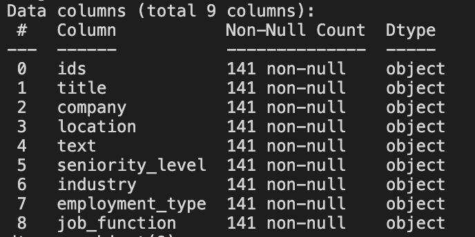
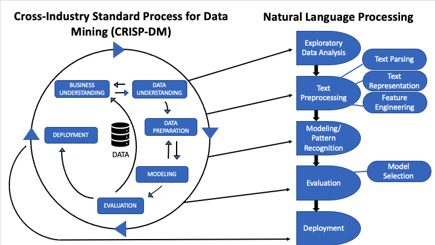

# Linkedin-job-analysis

<ol>
  <li>This program is a bot designed to obtain job info from linkedin.</li>
  <li>The results will be stored as text files names "position"_"company"</li>
  <li>The user inputs linkedin login info as well as the search keywords and location</li>
  <li>Lbraries used:
    <ul>
      <li>Selenium: for webscraping</li>
      <li>time: used for delay</li>
      <li>Tkinter: to obtain screen height and width</li>
      <li>getpass: to hide user password input</li>
    </ul>
    
  </li>
  <li>Creating a dataframe containing all job details with 9 columns.
  </img>
  </li>
  <li>Creating wordclouds of role titles and job details</li>
</ol>
 
## To Do:
<ul>
  <li>July, 7th, 2021: 
    <ol>
      <li>Find a way to see the top technical skills required</li>
      <li>Find key requirements</li>
      <li>Find education level requirements</li>
      <li>Find key responsibilities</li>
    </ol>
  </li>

</ul>

<ul>
  <li>July, 8th, 2021:
  <ol>
    <li>Research Unsupervised learning </li>
    <li><a href=https://towardsdatascience.com/unsupervised-nlp-methods-and-intuitions-behind-working-with-unstructured-texts-b84aa4d286da">Unsupervised NLP : Methods and Intuitions behind working with unstructured texts</a></li>
    <li><a href="https://medium.com/@rohithramesh1991/unsupervised-text-clustering-using-natural-language-processing-nlp-1a8bc18b048d">Unsupervised-Text-Clustering using Natural Language Processing(NLP)</a></li>
    <li>Keyword Extraction</li>
  </ol>
  
  </li> 
</ul>

## References
<ol style="fontsize=15px"> 
  <li><a href="https://towardsdatascience.com/natural-language-processing-workflow-1dddf3a48ab5">Natural Language Processing Workdflow</a></li>
  <li></li>
  <li></li>
  <li></li>
</ol>
</img>